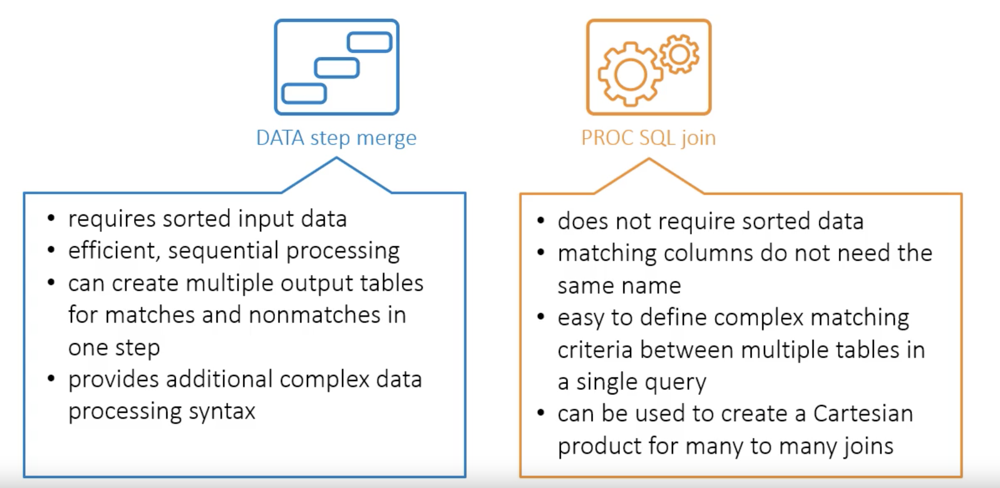

# NOTEs of *Doing More with SAS Programming*

<!-- TOC -->

- [1. Week1-*Controlling DATA Step Processing](#1-week1-controlling-data-step-processing)
- [2. Week2-*Summarizing Data*](#2-week2-summarizing-data)
- [3. Week3-*Manipulating Data with Functions*](#3-week3-manipulating-data-with-functions)
    - [3.1. 数值处理函数](#31-数值处理函数)
    - [3.2. 时间处理函数](#32-时间处理函数)
    - [3.3. 字符串处理函数](#33-字符串处理函数)
    - [3.4. 数据类型转换函数](#34-数据类型转换函数)
- [4. Week4-*Creating and Using Custom Formats*](#4-week4-creating-and-using-custom-formats)
    - [4.1. 自定义`format`](#41-自定义format)
    - [4.2. 从表格中创建`format`](#42-从表格中创建format)
    - [4.3. 查看`work`中的`format`：](#43-查看work中的format)
- [5. Week5-*Combining Tables*](#5-week5-combining-tables)
    - [5.1. concatenating](#51-concatenating)
    - [5.2. merge](#52-merge)
- [6. Week6-*Processing Repetitive Code*](#6-week6-processing-repetitive-code)
    - [6.1. 循环](#61-循环)
    - [6.2. 条件循环](#62-条件循环)
- [7. Week7-*Restructuring Tables*](#7-week7-restructuring-tables)
    - [7.1. 使用`DATA`](#71-使用data)
    - [7.2. 使用`PROC TRANSPOSE`](#72-使用proc-transpose)

<!-- /TOC -->

## 1. Week1-*Controlling DATA Step Processing

**PDV**概念

日志输出：

```sas
PUTLOG _ALL_; /* 打印所有列 */
PUTLOG column=; /* 打印指定列 */
PUTLOG "message"; /* 打印指定信息 */
```

>如果需要高亮message，在前面添加`NOTES: `即可。


## 2. Week2-*Summarizing Data*

**retain**

## 3. Week3-*Manipulating Data with Functions*


### 3.1. 数值处理函数

函数名|功能
|:---|:---|
CEIL (number)|Returns the smallest integer that is greater than or equal to the argument.
FLOOR (number)|Returns the largest integer that is less than or equal to the argument.
INT (number)|Returns the integer value.

### 3.2. 时间处理函数

函数名|功能
|:---|:---|
DATEPART｜
TIMEPART｜
INTCK｜
INTNX｜

### 3.3. 字符串处理函数

函数名|功能
|:---|:---|
COMPBL (string)|Returns a character string with all multiple blanks in the source string converted to single blanks.</br>*一个空格替换多个空格*
COMPRESS (string <, characters>)|Returns a character string with specified characters removed from the source string.</br>*删除特定字符*
STRIP (string)|Returns a character string with leading and trailing blanks removed.</br>*删除首尾空格*
SCAN|字符串截取（直接截取word）</br>有默认的单词分隔符
FIND|字符串查找
LENGTH (string)|Returns the length of a non-blank character string, excluding trailing blanks; returns 1 for a completely blank string.
ANYDIGIT (string)|Returns the first position at which a digit is found in the string.</br>*返回第一个数字位置*
ANYALPHA (string)|Returns the first position at which an alpha character is found in the string.</br>*返回第一个字母位置*
ANYPUNCT (string)|Returns the first position at which punctuation character is found in the string.</br>*返回第一个符号位置*
TRANWRD|字符串替换
CAT (string1, ... stringn)|Concatenates strings together, does not remove leading or trailing blanks.
CATS (string1, ... stringn)|Concatenates strings together, removes leading or trailing blanks from each string.
CATX ('delimiter', string1, ... stringn)|Concatenates strings together, removes leading or trailing blanks from each string, and inserts the delimiter between each string.

示例：
```sas
data weather_japan_clean;
    set pg2.weather_japan;
    NewLocation=compbl(Location);
    NewStation=compress(Station, "- ");
run;
```
>注：`compress`中需要删除的符号都放在一起，如示例中包含了`-`和` `两种。</br>
`compress`默认是删除空格的，不过如果要加上第二个参数，就需要特别注明空格。

### 3.4. 数据类型转换函数

函数名|功能
|:---|:---|
INPUT|字符串转数值
PUT|数值转字符串

>其中日期字符串转换时，类型可以使用`ANYDTDTEw.`

```sas
set table(rename=(col1=col2));
```
用于在创建数据时就修改数据类型。

示例：

```sas
data stocks2;
   set pg2.stocks2(rename=(Volume=CharVolume Date=CharDate)); /* 用于后续修改数据类型*/
   Volume=input(CharVolume,comma12.); /* from '5,976,252' to '5976252'*/
   Date=input(CharDate, date9.); /* from '01DEC2017' to '21154'*/
   drop Char: ;
run;
```

## 4. Week4-*Creating and Using Custom Formats*

>在`DATA`中修改的数据格式是永久的，但在`PROC`中时临时的（不影响原始数据的格式。）

### 4.1. 自定义`format`

```
PROC FORMAT;
    VALUE format-name value-or-range-1 = 'formatted-value'
                    value-or-range-2 = 'formatted-value'
                    . . . ;
RUN;
```

示例：
```sas
proc format;
    value $regfmt 'C'='Complete' /* 字符串带$号 */
                  'I'='Incomplete';
    value HRANGE 50-57 = 'Below Average' /* 数值不带$号 */
                  58-60 = 'Average'
                  61-70 = 'Above Average' ;
run;

proc print data=pg2.class_birthdate noobs;
    where Age=12;
    var Name Registration Height;
    format Registration $regfmt.;
    format Height hrange.;
run;
```

### 4.2. 从表格中创建`format`

```sas
/*Create the $SBFMT format for subbasin codes*/
data sbdata;
    retain FmtName '$sbfmt';
    set pg2.storm_subbasincodes(rename=(Sub_Basin=Start 
                                        SubBasin_Name=Label));
    keep Start Label FmtName;
run;

proc format cntlin=sbdata;
run;
```

### 4.3. 查看`work`中的`format`：
```sas
proc format fmtlib library=work;
	select $sbfmt catfmt; /* 可选择特定的format */
run;
```

>`format`默认存储在`work.formats`临时工作区，也可以指定存储位置，如`PG1.formats`。

## 5. Week5-*Combining Tables*

### 5.1. concatenating

```
DATA output-table;
    SET input-table1(rename=(current-colname=new-colname))
        input-table2 ...;
RUN;
```

示例：
```sas
data work.np_combine;
    set pg2.np_2014(rename=(Park=ParkCode Type=ParkType)) pg2.np_2015 pg2.np_2016;
    CampTotal=sum(of Camping:);
    where Month in(6, 7, 8) and ParkType="National Park";
    format CampTotal comma15.;
    drop Camping:;
run;
```

### 5.2. merge

```
DATA output-table;
    MERGE input-table1 input-table2 ...;
    BY BY-column(s);
RUN;
```

**数据必须先排序！**

示例：
```sas
proc sort data=pg2.class_teachers out=teachers_sort;
	by Name;
run;

proc sort data=pg2.class_test2 out=test2_sort;
	by Name;
run;

data class2;
	merge teachers_sort test2_sort;/* 顺序无关 */
	by Name;
run;
```

```
DATA output-table;
    MERGE input-table1(IN=var1) input-table2(IN=var2) ...;
    BY BY-column(s);
RUN;
```

通过两个表格的`in`来控制leftjoin、rightjoin、innerjoin和outerjoin。

示例：
```sas
data damage_detail storm_other(drop=Cost);
	merge storm_final_sort(in=inFinal) storm_damage(in=inDamage);
	keep Season Name BasinName MaxWindMPH MinPressure Cost;
	by Season Name;
	if inDamage=1 and inFinal=1 then output damage_detail;
	else output storm_other;
run;
```

* 如果有重名字段，在`merge`中使用`rename`。
* 多表联合，重复data merge步骤即可。
* `data step merge`和`proc sql join`都可用于多表联合，灵活使用。



## 6. Week6-*Processing Repetitive Code*

### 6.1. 循环

```
DATA output-table;
    . . .
    DO index-column = start TO stop <BY increment>;
        . . . repetitive code . . .
    END;
    . . .
RUN;
```

示例：
```sas
	do Year=1 to 4;
    	if Type='NM' then ForecastDV=ForecastDV*1.05;
    	if Type='NP' then ForecastDV=ForecastDV*1.08;
    	if Year= 4 then output;
    end;
```

### 6.2. 条件循环

**until**和**while**

```
DATA output-table;
    SET input-table;
    . . .
    DO UNTIL | WHILE (expression);
        . . . repetitive code . . .
        <OUTPUT;>
    END;
RUN;
```

示例：
```sas
    Year=0;
	do while (IncrDayVisits<=100000);
		Year+1;
    	IncrDayVisits=IncrDayVisits*1.06;
    	output;
	end;
```

## 7. Week7-*Restructuring Tables*

**修改表结构**

### 7.1. 使用`DATA`

### 7.2. 使用`PROC TRANSPOSE`

```
PROC TRANSPOSE DATA=input-table OUT=output-table
    PREFIX=column> <NAME=column>; <VAR columns(s);> <ID column;>
    <BY column(s);> 
RUN;
```

示例：
```sas
proc transpose data=pg2.np_2017camping out=work.camping2017_t(rename=(COL1=Count)) name=Location;
	by ParkName;
	var Tent RV;
run;
```

```sas
proc transpose data=pg2.np_2016camping out=work.camping2016_t(drop=_NAME_);
	var CampCount;
	by ParkName;
	id CampType;
run;
```