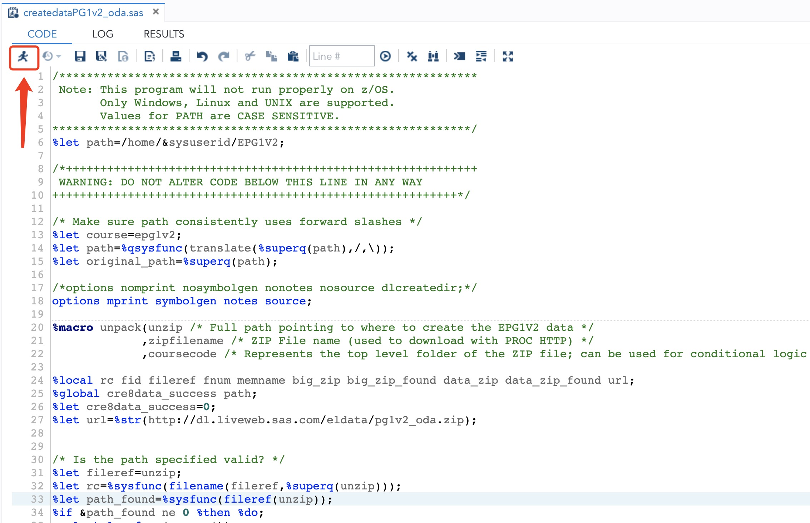

# 如何使用在线SAS Studio

由于SAS本身是付费软件，而且安装在本机会比较麻烦，如果只是完成课程学习，完全可以使用免费的online Studio。下面介绍如何注册使用并上传*upload*课程文件。
>不过需要翻墙，并且使用时需要稳定的网络，经常掉线连接不上服务器会很心烦。

<!-- TOC -->

- [1. 注册账号并登录](#1-注册账号并登录)
- [2. 打开SAS Studio](#2-打开sas-studio)
- [3. 上传课程文件](#3-上传课程文件)
- [4. run文件](#4-run文件)

<!-- /TOC -->

## 1. 注册账号并登录

打开下面网址，免费注册账号登录：

[SAS OnDemand for Academics](https://odamid.oda.sas.com/)

## 2. 打开SAS Studio

登陆后会进入如下界面：

其中`1`为`SAS Studio`入口，`2`为划分给此用户的存储空间使用情况。

点击进入`SAS Studio`即可。（*这里由于网络问题，以及服务器本身加载问题，会有一点慢，请耐心等待*）

下面为正常加载后的`SAS Studio`界面：

左边是导航栏，右边是coding空间。

左边当前主要会用到2个部分：
- `1`是`server files and folders`，用来查看脚本及数据文件；
- `2`是`libraries`，是SAS概念中的只存放sas格式数据的数据库（在后面的教学章节中会详细介绍这个`libraries`概念和构建方式）。

右边打开后会主要包括三个部分：
- `code`

    coding界面，用于编辑sas脚本。

- `log`

    运行脚本时展示运行日志，包括`errors`，`warnings`以及`notes`。

- `results`

    结果展示界面。

有表格内容输出时，还会有一个`output data`界面。

示例如下图：

## 3. 上传课程文件

将课程`Getting Started with SAS Programming`中下载的数据文件上传到`SAS Studio`中。

1. 打开`server files and folders`中的`Files(home)`
2. 右键点击`Files(home)`创建新文件夹`EPG1V2`(*这里文件夹名字大写，保持一致*)
3. 点击`upload`（*上传文件*）图标，在弹窗中选择要上传的文件`createdataPG1v2_oda.sas`（在本git路径:`./scripts/createdataPG1v2_oda.sas`可以下载），上传即可
4. 文件上传完毕后，就能在`EPG1V2`文件夹中看到，双击文件，在右侧窗口即可看到文件内容。

## 4. run文件

点击`run`命令，等待文件运行即可。

